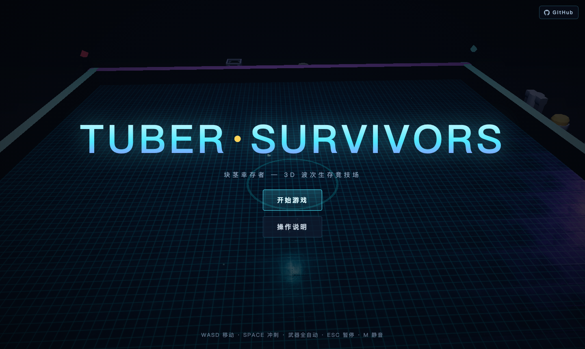

# TUBER SURVIVORS — 块茎幸存者

3D 类幸存者动作游戏（Brotato 风格），Three.js + Vite 构建。在竞技场中抵御一波波外星敌人：武器自动索敌、拾取晶体升级三选一、波次间进商店补给，撑过第 20 波击败终 Boss 即胜利。

## 游戏画面



## 在线游玩

- **GitHub Pages**：<https://holynova.github.io/tuber-survivors/>
- 手机扫码直达：


## 本地运行

```bash
npm install
npm run dev      # http://localhost:5173
npm run build    # 产出 docs/（GitHub Pages 部署产物）
```

## 操作

WASD 移动 · 空格冲刺（短暂无敌）· 武器全自动 · 1/2/3 升级快捷键 · Esc 暂停 · M 静音

## 仓库

<https://github.com/holynova/tuber-survivors>
