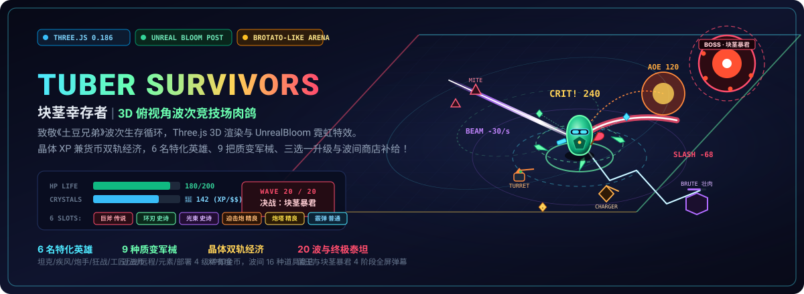
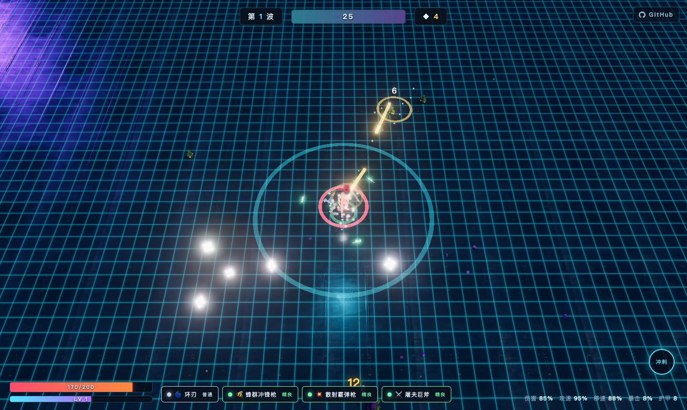

<p align="center">
  
</p>

<p align="center">
  <a href="https://holynova.github.io/tuber-survivors/"></a>
  <a href="https://threejs.org/"></a>
  <a href="https://vite.dev/"></a>
  
  
  <a href="https://github.com/holynova/tuber-survivors"></a>
</p>

---

## 🥔 游戏简介 (Overview)

**块茎幸存者 (Tuber Survivors)** 是一款深度致敬《土豆兄弟 (Brotato)》核心节奏的 **3D 俯视角波次生存竞技场 Roguelite 游戏**。采用 Three.js 驱动深空发光竞技场与卡通低模造型，配合 UnrealBloom 后期辉光与数千并发粒子，带来打击感拉满的畅快割草体验！

- 💠 **深空霓虹竞技场**：近黑地面、青蓝网格线、边界发光力场与指数雾，搭配 `EffectComposer` + `UnrealBloomPass` 带来沉浸式霓虹质感。
- 💎 **晶体双轨经济 (XP = 货币)**：击杀敌人掉落高能晶体，拾取即提升经验等级，并在波次结算时化作商店消费金币。
- ⚔️ **6 槽位多持军火库**：支持装备多达 6 把不同武器（近战、远程、元素、哨戒部署），全自动索敌，走位即输出。
- 🛡️ **翻滚无敌突围**：空格冲刺提供 0.25 秒伤害免疫，冷却仅 1.4 秒，在绝境怪潮中闪展腾挪。
- 🔊 **纯程序化音频合成**：基于 WebAudio API 实时合成枪火、挥砍、爆炸与受击音效，免外部音频资源加载。

---

## 🎮 在线试玩与截图 (Play Online & Showcase)

<p align="center">
  <a href="https://holynova.github.io/tuber-survivors/"><strong>👉 点击直接在浏览器畅玩：holynova.github.io/tuber-survivors 👈</strong></a>
</p>

<p align="center">
  <br>
  <em>手机浏览器扫码亦可快速打开体验（推荐 PC 键盘沉浸操作）</em>
</p>

<p align="center">
  
</p>

---

## 🕹️ 操作与热键 (Controls)

| 操作 | 热键 | 战术要点 |
|:---|:---|:---|
| **移动走位** | <kbd>W</kbd> <kbd>A</kbd> <kbd>S</kbd> <kbd>D</kbd> 或 方向键 | 45° 俯视角透视跟随，保持移动避免被围死 |
| **战术翻滚** | <kbd>Space</kbd> (空格) | 0.25 秒绝对无敌帧判定，冷却 1.4 秒 |
| **武器索敌** | 全自动攻击 | 远程武器自动瞄准 9 米内最近敌人，近战以朝向/目标为轴 |
| **游戏暂停** | <kbd>Esc</kbd> | 暂停游戏随时检视当前属性面板与武器品阶 |
| **音效开关** | <kbd>M</kbd> | 一键静音 / 开启 WebAudio 音效 |

---

## 👤 6 名特化英雄 (Characters)

每个角色拥有鲜明的属性倾斜与**颠覆性被动技能**：

| 英雄 | 定位 | 属性倾向 | 核心专属被动 | 初始武器 |
|:---|:---|:---|:---|:---|
| **巴克·铁壁 (Buck)** | 重装坦克 | 生命 200, 护甲 8, 移速 -12% | **荆棘震荡**：每承受 6 次伤害，释放反伤冲击波 (25 伤 + 强击退) | 环刃 (常驻旋转切割) |
| **薇拉·疾风 (Vera)** | 闪避速射 | 移速 +40%, 闪避 15%, 生命 78 | **残影**：冲刺后 3 秒内首次攻击必定暴击 (×2.2 暴击倍率) | 蜂群冲锋枪 (极速压制) |
| **卡尔·炮手 (Karl)** | 远程压制 | 远程伤害 +45%, 近战 -45% | **火力压制**：连续命中同一目标每层 +12% 伤害 (最多叠加 5 层) | 散射霰弹枪 (锥面多发) |
| **格罗什·狂战 (Grosh)** | 近战吸血 | 近战伤害 +45%, 远程 -20% | **血怒**：生命低于 50% 时伤害 +60%、吸血 +15%，越残越强 | 屠夫巨斧 (120° 大范围) |
| **缇娜·工匠 (Tina)** | 炮塔阵地 | 拾取 +20%, 全伤害 -10% | **机械随从**：开局自带 1 座自动炮塔，炮塔伤害 +60%，上限 2 座 | 哨戒炮塔 (自动索敌) |
| **梅琳·奥术 (Meryl)** | 元素法师 | 元素伤害 +50%, 暴击 +10%, 护甲 0 | **过载电容**：电系链跳 +2，元素命中 15% 概率眩晕目标 0.6 秒 | 电弧线圈 (跳跃电浆) |

---

## ⚔️ 9 种质变军械 (Arsenal & Weapons)

武器分为 **普通 (白) / 精良 (绿) / 史诗 (紫) / 传说 (金)** 四大品阶，基础数值按 `1.0 / 1.4 / 1.85 / 2.4` 倍率成长并解锁质变词缀：

| 武器 | 类别 | 弹道与作战特性 | 满阶传说质变效果 |
|:---|:---:|:---|:---|
| **铆钉手枪 (Pistol)** | 远程 | 高速直线单发弹，极短冷却，万金油输出 | 伤害 +140%，贯穿穿透 2 个目标 |
| **散射霰弹枪 (Shotgun)** | 远程 | 喷射 6 发扇面弹丸，近距离爆发与强击退 | 10 发弹丸齐射，伤害 +140% 且附加穿透 |
| **蜂群冲锋枪 (SMG)** | 远程 | 极高射速连击，微小散布，弹幕泼洒专家 | 伤害 +140%，攻击速度额外提升 +30% |
| **屠夫巨斧 (Cleaver)** | 近战 | 身前 120° 巨幅圆弧 AOE，一击扫飞整群敌人 | 伤害 +140%，挥砍打击范围扩大 +35% |
| **环刃 (Orbit Blades)** | 近战 | 常驻刀刃围绕身侧高速旋转，走位即割草 | 扩充至 6 片环绕刀刃，转速大幅加成 |
| **迫击炮 (Mortar)** | 元素 | 抛物线重炮，落地延迟爆炸产生 AOE 与地面灼烧 | 伤害 +140%，爆炸波及半径提升 +35% |
| **电弧线圈 (Chain)** | 元素 | 瞬发闪电弧光，在多个目标之间极速链式跳跃 | 伤害 +140%，链跳跃至 6 目标并附加眩晕 |
| **棱镜光束 (Prism Beam)** | 元素 | 贯穿全屏的持续高温激光，无视前排直击后排 | 伤害 +140%，照射射程大幅延长 +50% |
| **哨戒炮塔 (Turret)** | 部署 | 在地面部署自动索敌旋转炮台，持续火力支援 | 伤害 +140%，升级为双联装重型炮台 |

---

## 📈 循环成长：三选一升级与波间商店 (Progression)

### 1. 升级三选一 (12 种词条池)
战斗中拾取晶体提升等级，从随机加权词条中自选其一：
- **生命强化** (Max HP +20) · **火力全开** (全部伤害 +10%) · **疾风步** (移速 +8%)
- **急速射击** (攻速 +8%) · **致命一击** (暴击率 +5%) · **硬化表皮** (护甲 +3)
- **幻影闪避** (闪避 +4%) · **强效磁力** (拾取范围 +30%) · **汲取** (吸血 +2%)
- **元素共鸣** (元素伤 +12%) · **臂力训练** (近战伤 +12%) · **精密枪管** (远程伤 +12%)

### 2. 波间战术商店 (16 种强化道具)
每波生存结束后进入商店，消耗战斗所得晶体补给：
- **动力靴** (+12% 移速) · **战术瞄准镜** (+7% 暴击) · **肾上腺素** (+10% 攻速)
- **复合装甲** (+4 护甲) · **超导磁石** (+45% 拾取) · **血棘指环** (+3% 吸血)
- **硝化甘油** (+20% AOE) · **超频核心** (+8% 全局伤害) · **磨刀石** (+15% 近战)
- **速燃火药** (+15% 远程) · **奥术水晶** (+18% 元素) · **生命晶体** (+25 上限并恢复)
- **分裂棱镜** (+40% 暴伤) · **缓冲弹簧** (+5% 闪避) · **震波号角** (+30% 击退) · **鹰眼义眼** (+12% 射程 & 3% 暴击)
- 支持**刷新商品**、**购买新武器**与**出售多余装备**。

---

## 👾 敌人波次与两大首领 (Enemies & Bosses)

波次时长由第 1 波的 22 秒逐波递增至 45 秒，撑过 20 波击杀最终 Boss 即宣告通关：

```
Wave 1-2:   啃食者 (Mite) —— 基础敏捷追击单位
Wave 3-4:   壮肉 (Brute) 登场 —— 缓慢高碰撞体积巨兽
Wave 5:     【首领】菌王 (Brood) —— 践踏冲击波 + 冲撞 + 召唤杂兵
Wave 6-7:   冲锋兽 (Charger) —— 0.7s 蓄力警示后超高速突刺
Wave 8-9:   自爆虫 (Bomber) —— 靠近自爆或死亡爆裂范围 AOE
Wave 10:    【首领】菌王二次狂暴进化
Wave 11-19: 孢子喷吐者与全怪物混合狂暴攻潮，同屏上限 120 怪物预算
Wave 20:    【最终首领】块茎暴君 (Tyrant) —— 4 阶段全屏弹幕、践踏、冲撞与召唤！
```

---

## 💻 本地运行与构建 (Development)

本项目采用现代前端轻量架构：

```bash
# 1. 克隆仓库
git clone https://github.com/holynova/tuber-survivors.git
cd tuber-survivors

# 2. 安装依赖 (Three.js 与 Vite)
npm install

# 3. 启动开发服务器 (支持热重载 HMR)
npm run dev

# 4. 生产环境构建打包
npm run build

# 5. 本地预览生产构建产物
npm run preview
```

生产构建将完整输出至 `docs/` 目录，原生支持 GitHub Pages 自动化发布。

---

## 📄 授权协议 (License)

本项目基于 [ISC License](./package.json) 开源，欢迎学习、交流与衍生改进！
